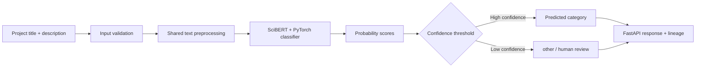
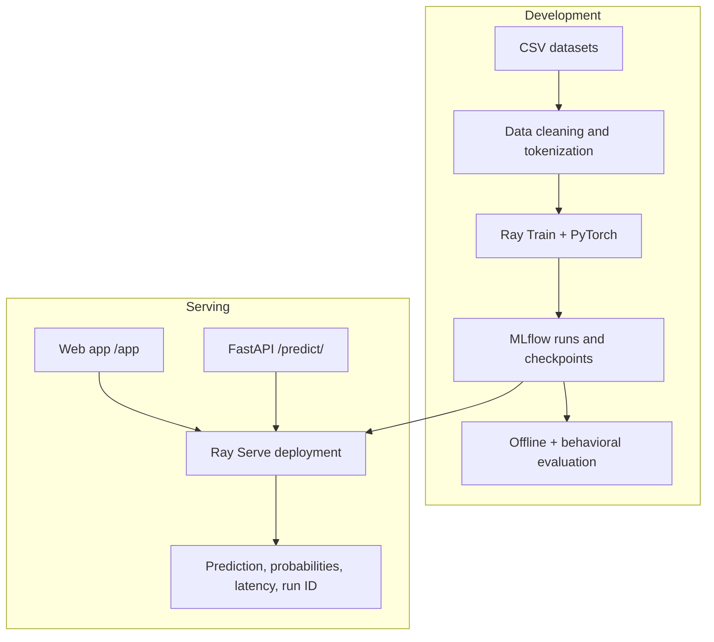
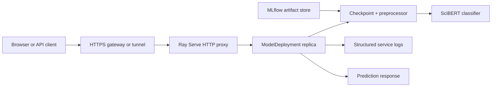
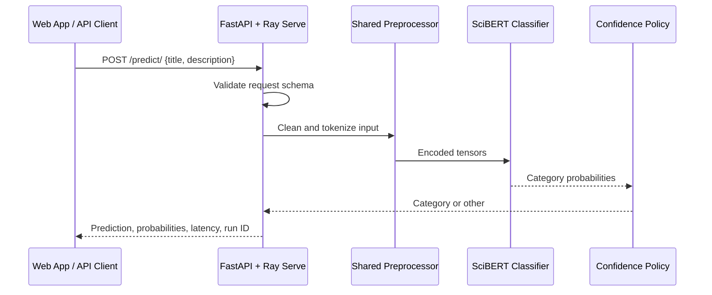
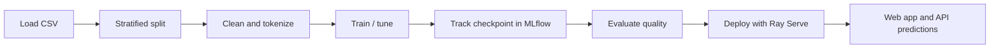

<div align="center">


# Made With ML · Project Classifier

### A production-minded NLP system that classifies machine-learning project descriptions in real time.

[](https://www.python.org/)
[](https://www.ray.io/)
[](https://fastapi.tiangolo.com/)
[](https://pytorch.org/)
[](LICENSE)
[](https://github.com/ramsaij158-pixel/Transfer-learning-with-transformers/actions)
[](https://github.com/ramsaij158-pixel/Transfer-learning-with-transformers/commits/main)
[](https://github.com/ramsaij158-pixel/Transfer-learning-with-transformers/stargazers)
[](https://github.com/ramsaij158-pixel/Transfer-learning-with-transformers/network/members)
[](https://github.com/ramsaij158-pixel/Transfer-learning-with-transformers/issues)
[](https://github.com/ramsaij158-pixel/Transfer-learning-with-transformers/pulls)
[](#-contributing)

[Explore the API](#-api-reference) · [Run locally](#-installation) · [Use the web app](#-usage) · [Contribute](#-contributing)

</div>

---

## 📚 Table of Contents

- [Project Overview](#-project-overview)
- [Problem Statement](#-problem-statement)
- [Solution](#-solution)
- [Why This Project?](#-why-this-project)
- [Key Features](#-key-features)
- [Benefits and Applications](#-benefits-and-real-world-applications)
- [Technology Stack](#-technology-stack)
- [Architecture](#-architecture)
- [Folder Structure](#-folder-structure)
- [Installation](#-installation)
- [Configuration](#%EF%B8%8F-configuration)
- [Usage](#-usage)
- [API Reference](#-api-reference)
- [Workflow and Modules](#-workflow-and-project-modules)
- [Testing, Performance, and Security](#-testing-performance-and-security)
- [Roadmap](#%EF%B8%8F-roadmap)
- [Contributing](#-contributing)
- [Community Statistics](#-community-statistics)
- [License, Author, and Support](#-license-author-and-support)
- [FAQ](#-faq)
- [Implementation Notes](#-implementation-notes)

---

## 🔎 Project Overview

**Made With ML · Project Classifier** turns an unstructured machine-learning project title and description into a useful category prediction. It combines SciBERT-based text classification, Ray-powered training and serving, MLflow experiment tracking, FastAPI request validation, and a browser interface into one reproducible application.

The project was created to demonstrate how an ML model moves beyond a notebook: data is prepared consistently, experiments are traceable, the chosen model is evaluated, and predictions are available through a live API. It is useful for ML marketplaces, internal project catalogs, learning platforms, research repositories, and teams that need a first-pass taxonomy for incoming project descriptions.

At a practical level, the service answers a simple question: *given a short explanation of an ML project, what kind of work does it represent?* The answer can power search filters, routing rules, analytics, curated directories, and human-review queues. Rather than forcing an administrator to read every submission and select a label, the application provides an immediate recommendation and exposes its confidence so that a product team can decide when automation is appropriate.

For students, the repository is a hands-on map of a modern ML lifecycle. It connects familiar modeling concepts—tokenization, training loss, validation, and prediction—to production concerns such as input contracts, observability, artifact lineage, container packaging, and deployment configuration. For engineers, it demonstrates how a model can be wrapped in an API without losing the ability to reproduce which weights and preprocessing were used. For researchers and data scientists, it offers a clean place to extend evaluation slices, datasets, labels, hyperparameters, or model architecture.

Organizations can use the same pattern wherever text needs to be classified at intake. A platform might categorize project proposals before they reach a reviewer; a technical-support portal might route requests to the right queue; a learning platform might group course submissions by discipline. The supplied model focuses on machine-learning project text, but the architecture is intentionally general: replace the dataset and label taxonomy, retrain, evaluate, and serve the new checkpoint through the same contract.

The repository does not claim that an automated category is always correct. It explicitly recognizes uncertainty. When the top probability is lower than the configured threshold, the prediction is returned as `other`. This design makes the application a better fit for real workflows, where ambiguous content should be reviewed rather than silently assigned a misleading label.

> [!NOTE]
> The classifier is a decision-support tool. Low-confidence predictions are routed to the `other` category instead of being presented as certain.

## 🎯 Problem Statement

Machine-learning project descriptions are often free-form, inconsistent, and expensive to organize manually. A repository or internal catalog can quickly become difficult to search when every contributor names technologies and disciplines differently. Traditional keyword rules are brittle: they fail when terminology changes, require ongoing manual maintenance, and do not quantify uncertainty.

This project addresses that gap by learning category signals from text. It preserves the full path from raw data to an online prediction, making the result easier to reproduce, inspect, test, and improve than an isolated model script.

### Industry challenge

Technical teams create and consume large volumes of unstructured text: repository descriptions, experiment notes, project proposals, support tickets, knowledge-base articles, and research summaries. The vocabulary is broad and evolves quickly. One contributor might describe a task as “vision,” another as “image understanding,” and a third as “object detection.” The same project may mention a framework, a model family, a business domain, and an implementation detail in only a few sentences. Manual normalization is accurate when performed by an expert, but it does not scale economically as volume grows.

Simple rules can help at first, but rules are difficult to maintain. A keyword such as “transformer” is informative in some contexts and misleading in others. Keyword systems also tend to have no useful uncertainty estimate, so they encourage overconfident automation. A production-quality approach needs learned language representations, measurable validation, versioned artifacts, and a deliberate fallback for uncertain inputs.

### Why automation matters

Automation does not replace domain expertise; it directs expertise toward the cases where it has the most value. High-confidence examples can be categorized immediately, while low-confidence examples can be queued for review. This reduces repetitive work, creates a measurable feedback loop, and gives teams a way to improve the underlying taxonomy over time. In cost-sensitive environments, it also helps avoid making every newly submitted record a manual task.

## 💡 Solution

The solution processes a title and description with the same preprocessing used during training, encodes the text with SciBERT, and predicts a project category with calibrated probability scores. Ray distributes data and training workloads; MLflow records experiments and artifacts; Ray Serve hosts the selected checkpoint behind a FastAPI contract.

### End-to-end processing stages

1. **Input collection:** a caller supplies a project title and description through the web interface or `POST /predict/` endpoint.
2. **Validation:** FastAPI and Pydantic require non-empty text and limit title and description length before expensive inference begins.
3. **Preprocessing:** the service applies the same cleaning and tokenization pipeline used when the model was trained. This is essential for preventing training-serving skew.
4. **Model inference:** SciBERT produces a pooled text representation, and the PyTorch classification head converts that representation into category scores.
5. **Probability and policy evaluation:** scores are normalized into probabilities. The confidence threshold decides whether the highest-scoring label is returned or replaced with `other`.
6. **Observable response:** the API returns the label, class probabilities, request ID, model run ID, and latency. These fields are useful for debugging, product analytics, and future evaluations.

During development, Ray Data handles dataset operations and Ray Train executes the training loop. The loop tracks validation loss, applies a learning-rate scheduler, and saves checkpoints. MLflow records the experiment metadata and artifacts. A selected checkpoint can then be restored through `predict.py`, evaluated with holdout and behavioral checks, and mounted in a Ray Serve deployment. The serving process loads the predictor once per replica rather than rebuilding the model for every request.



## ✨ Why This Project?

- **Useful by design:** it exposes a model as an API and web experience, rather than stopping at offline training.
- **Traceable predictions:** each online response includes a request ID, model run ID, and latency.
- **Consistent behavior:** training and serving reuse the same preprocessing and checkpoint metadata.
- **Scalable foundation:** Ray supports local execution now and distributed deployment later.
- **Safer defaults:** validated request sizes, readiness checks, structured logging, and a confidence fallback reduce avoidable operational risk.

### Business value

The immediate business value is consistent, fast classification of incoming technical text. Instead of requiring every user to understand a taxonomy before submitting information, a product can offer a recommendation and use the result to improve search, navigation, reporting, and routing. This creates a smoother intake experience and makes a growing archive more useful over time.

The model run ID returned with each request is especially valuable in a business setting. When a stakeholder asks why a category changed or how a historical response was generated, teams can identify the exact tracked run that served the result. That is a stronger operational story than a model file copied between machines without experiment context.

### Educational and engineering value

Many ML demonstrations stop after reporting a metric. This repository deliberately includes the work that makes a model usable: deterministic preprocessing, a request schema, readiness probes, test directories, deployment definitions, container packaging, and CI workflows. The result is useful both as an application and as a portfolio artifact that shows how data science, software engineering, and platform thinking fit together.

### Maintainability and scalability

The code is divided by responsibility rather than written as a single notebook. Data preparation, modeling, training, tuning, evaluation, prediction, and serving have clear boundaries. This makes it easier to replace one component without rewriting the entire application. Ray resource settings and deployment configuration allow the same core workload to start on a laptop and later move to larger infrastructure.

## 🛠️ Key Features

| Feature | Description |
|---|---|
| 🧠 SciBERT classifier | Fine-tunes a transformer-based model for ML-project text classification. |
| ⚡ Real-time inference | Serves `POST /predict/` through FastAPI and Ray Serve. |
| 🎨 Browser app | Provides a responsive `/app` interface with example inputs, confidence bars, and latency. |
| 📊 Experiment tracking | Records training metadata, metrics, checkpoints, and run IDs with MLflow. |
| 🔁 Hyperparameter tuning | Uses Ray Tune and HyperOpt-compatible search workflows for configurable runs. |
| ✅ Data and model tests | Includes code, dataset, and behavioral model test suites. |
| 🩺 Operational endpoints | Supplies index, readiness, run-ID, prediction, and evaluation endpoints. |
| 🐳 Container-ready | Includes a non-root Python 3.10 Docker runtime image. |
| ☁️ Deployment templates | Includes Anyscale/Ray job and service configuration, plus GitHub Actions workflows. |

<details>
<summary><strong>How the main features work in practice</strong></summary>

#### Transformer-based language understanding

The model uses SciBERT as its language encoder. SciBERT is a BERT-family model trained on scientific text, making it a practical starting point for technical descriptions that contain domain-specific vocabulary. The repository adds a dropout layer and linear classification head, then fine-tunes the stack for the available project categories. This is more robust than counting words because the model can use context across a title and description.

#### Experiment tracking and artifact lineage

Each Ray training or tuning run can be tracked through MLflow. The tracked artifacts include run metadata, parameters, metrics, and checkpoints. The serving layer selects a checkpoint by run ID and exposes that ID in every prediction response. This design lets a team compare experiments, reproduce a result, and roll a service back to a prior known model when needed.

#### Live browser experience

The `/app` page is not a mockup. It calls the same live `/predict/` endpoint used by programmatic consumers. It gives nontechnical users a focused workflow: choose an example or enter a title and description, submit, and inspect the predicted label, confidence distribution, latency, and request identifier. The page is responsive and uses no separate frontend build pipeline, which keeps the demo easy to run with the API.

#### Confidence-aware response policy

Models always produce a highest-probability class, even when every class is uncertain. The confidence policy avoids treating that mathematical fact as a product decision. If the winning class falls below the configured threshold, the service intentionally returns `other`. In a mature product, `other` can feed a review queue and become labeled training data for the next release.

</details>

## 🌍 Benefits and Real-World Applications

| Benefit | Why it matters | Example use |
|---|---|---|
| Saves time | Reduces repetitive first-pass project tagging. | Categorize new submissions in an ML portal. |
| Improves discovery | Consistent categories improve filtering and search. | Build a searchable internal knowledge base. |
| Supports review | Low-confidence results can be sent to a human reviewer. | Route ambiguous submissions to an annotation queue. |
| Improves productivity | Gives teams a reusable inference API instead of a manual workflow. | Enrich project records during intake. |
| Scales responsibly | Ray replicas and configurable CPU/GPU settings support larger workloads. | Serve a growing community or enterprise catalog. |

### Who benefits

**Students and learners** can use the repository to understand how a text classifier is trained, tracked, tested, exposed through an API, and presented in a web interface. The separation of modules makes it easier to study one concern at a time. Students can also replace the dataset with a different text-classification problem to practice the full workflow.

**Developers and platform engineers** benefit from the request contract, health endpoint, container configuration, CI examples, and deployment templates. These pieces show how an ML workload can participate in ordinary engineering practices: version control, test automation, structured logs, and reproducible environments.

**Data scientists and researchers** can experiment with hyperparameters, new labels, data slices, or model architectures without losing the baseline workflow. Ray Tune and MLflow provide a structure for comparing runs, while the evaluation module gives a place to add metrics that matter for a specific problem.

**Organizations and businesses** can use the pattern to reduce manual triage, improve metadata consistency, and build a feedback-driven categorization workflow. A business should validate the taxonomy, security posture, data-retention policy, and performance target for its own domain before production deployment.

### Real-world application scenarios

| Domain | Example workflow | Value delivered |
|---|---|---|
| Research laboratories | Classify research-project summaries before indexing them in a shared catalog. | Faster discovery across interdisciplinary work. |
| Universities | Group student capstone proposals by area for faculty review. | Less manual routing and more balanced reviewer assignment. |
| AI startups | Tag customer use cases or integration requests. | Consistent analytics for product and sales teams. |
| Enterprise knowledge platforms | Categorize internal ML initiatives, proof-of-concepts, and experiment summaries. | Searchable inventory and governance visibility. |
| Open-source communities | Recommend topic categories for new repositories or issue templates. | Better navigation and contributor discovery. |
| Education platforms | Organize tutorial or project submissions into learning tracks. | Clearer learning paths and content recommendations. |
| Cloud and ML platforms | Route model-support requests based on technical content. | Faster initial triage before expert escalation. |

The supplied classifier should not be used as a medical, financial, legal, employment, or safety-critical decision maker. It is a technical-text categorization example. High-impact use cases require additional domain validation, governance, privacy controls, monitoring, and human oversight.

## 🧰 Technology Stack

| Area | Technologies |
|---|---|
| Language | Python 3.10 |
| Machine learning | PyTorch, Transformers, SciBERT |
| Distributed compute | Ray Data, Ray Train, Ray Tune, Ray Serve |
| Experiment tracking | MLflow |
| API backend | FastAPI, Pydantic |
| Data and evaluation | Pandas, NumPy, scikit-learn, Snorkel |
| Testing and quality | pytest, pytest-cov, Black, isort, Flake8, pre-commit |
| Frontend | Responsive HTML, CSS, and browser JavaScript served by FastAPI |
| Deployment | Docker, Anyscale configuration, GitHub Actions, Cloudflare Tunnel for temporary sharing |

<details>
<summary><strong>Why these technologies were selected</strong></summary>

| Technology | Why it fits this project | Common alternatives |
|---|---|---|
| Python | Mature ecosystem for data, ML, APIs, and experimentation. | Java, Scala, Julia, or TypeScript depending on platform needs. |
| PyTorch | Flexible model definition and widely used transformer integration. | TensorFlow/Keras, JAX, or ONNX Runtime for selected deployment patterns. |
| SciBERT / Transformers | Strong starting point for technical and scientific language. | General BERT, RoBERTa, DistilBERT, embedding models, or a custom domain encoder. |
| Ray | Provides a unified approach to data processing, training, tuning, and serving. | Dask, Spark, Kubernetes-native training stacks, or separate task-specific tools. |
| MLflow | Records experiment metadata and artifacts in a tool-agnostic format. | Weights & Biases, Neptune, ClearML, or cloud-provider experiment services. |
| FastAPI | Produces type-validated HTTP APIs and interactive OpenAPI documentation. | Flask, Django REST Framework, or gRPC for different service requirements. |
| Docker | Creates a repeatable runtime image with an explicit Python version. | VM images, Conda environments, or platform-native buildpacks. |

</details>

## 🏗️ Architecture



### Deployment view



In local development, the browser can call the service directly at `127.0.0.1:8000`. A Cloudflare Quick Tunnel can make that local port available for a temporary demonstration, but it is not a persistent production architecture. For a durable deployment, place the service behind managed HTTPS, authentication, access controls, observability, and appropriate infrastructure.

### Prediction sequence



### Architecture responsibilities

The **client layer** contains the browser interface and any programmatic consumer. The **service layer** validates input, creates a request identifier, coordinates prediction, and returns a stable response schema. The **model layer** restores the checkpoint and preprocessing metadata together. The **tracking layer** holds MLflow run context and artifacts. The **operations layer** consists of health checks, logs, resource configuration, CI workflows, and deployment files.

## 📂 Folder Structure

```text
.
├── madewithml/
│   ├── data.py             # Dataset loading, splitting, cleaning, tokenization
│   ├── models.py           # SciBERT classification head and checkpoint I/O
│   ├── train.py            # Ray Train workflow
│   ├── tune.py             # Ray Tune hyperparameter search workflow
│   ├── evaluate.py         # Offline and slice-level evaluation
│   ├── predict.py          # Checkpoint restoration and prediction helpers
│   ├── serve.py            # FastAPI + Ray Serve deployment
│   ├── config.py           # Paths, logging, MLflow configuration
│   └── web/
│       ├── index.html      # Responsive classifier interface
│       └── README.md       # Web interface guide and color system
├── datasets/               # Training, holdout, tag, and project CSV files
├── deploy/                 # Ray/Anyscale job and service definitions
├── tests/                  # Code, data, and model test suites
├── docs/                   # MkDocs documentation source
├── notebooks/              # Interactive exploration and benchmarking notebooks
├── .github/workflows/      # Quality, documentation, workload, and service CI
├── Dockerfile              # Non-root runtime image
├── requirements.txt        # Python dependencies
└── INTERVIEW_GUIDE.md      # Architecture and interview narrative
```

The source tree follows a deliberate separation of concerns. Files in `madewithml/` implement the product path from data to inference. Files in `tests/` validate behavior independently of the notebooks. Files in `deploy/` describe how the project can be run as a managed job or service. This structure helps contributors understand where a change belongs and prevents a serving concern from becoming entangled with an experimentation concern.

## 🚀 Installation

### Prerequisites

- Python 3.10
- Git
- A machine with enough memory to load SciBERT; GPU is optional

### Local setup

```bash
git clone https://github.com/ramsaij158-pixel/Transfer-learning-with-transformers.git
cd Transfer-learning-with-transformers

python3 -m venv venv
source venv/bin/activate
python -m pip install --upgrade pip setuptools wheel
python -m pip install -r requirements.txt
```

Create local configuration:

```bash
cp .env.example .env
source .env
export PYTHONPATH="$PWD"
```

> [!TIP]
> If Typer reports that command option values are “unexpected extra arguments,” install the compatible Click version: `python -m pip install "click==8.1.7"`.

### What each setup command does

`python3 -m venv venv` creates an isolated Python environment inside the repository. Isolation prevents this project’s dependencies from accidentally changing packages used by other projects on the same computer. `source venv/bin/activate` switches the terminal to that environment; the prompt typically shows `(venv)` when it is active.

`python -m pip install -r requirements.txt` installs the pinned libraries used for training, serving, testing, notebooks, and documentation. The first run may take time because PyTorch, Ray, and transformer dependencies are substantial. When the model is first loaded, Transformers may also download the SciBERT checkpoint to the local model cache.

The `.env.example` file contains safe local defaults. Set `GITHUB_USERNAME=local` for local development. Do not add cloud tokens, API keys, or passwords to the committed `.env.example` file. Use your platform’s secrets manager or CI secret store for real deployment credentials.

### Installation troubleshooting

| Symptom | Likely cause | Resolution |
|---|---|---|
| `ModuleNotFoundError: No module named 'ray'` | The virtual environment is not active. | Run `source venv/bin/activate`, then reinstall requirements if necessary. |
| `No module named 'madewithml'` | Python cannot see the repository root. | Run `export PYTHONPATH="$PWD"` from the project root. |
| `KeyError: 'GITHUB_USERNAME'` | Required local environment setting is missing. | Run `export GITHUB_USERNAME="local"`. |
| CLI values show as unexpected arguments | Incompatible Click/Typer combination. | Install `click==8.1.7`, then rerun the command. |
| Model loading is slow | SciBERT is downloading or loading into memory. | Wait for the first load; later runs use the local cache. |
| Port `8000` is busy | Another API process is using the default service port. | Stop the old process or free the port before starting the service. |

## ⚙️ Configuration

The application reads environment variables from the shell or `.env` file. Do not commit secrets or cloud credentials.

| Variable | Default | Purpose |
|---|---:|---|
| `GITHUB_USERNAME` | required by Ray runtime setup | Names the workspace used by the project configuration. Use `local` for local development. |
| `MLFLOW_TRACKING_URI` | local file store | Location of MLflow experiments and artifacts. |
| `MODEL_REPLICAS` | `1` | Number of Ray Serve model replicas. |
| `MODEL_CPUS` | `1` | CPU allocation per serving replica. |
| `MODEL_GPUS` | `0` | GPU allocation per serving replica. |

### Configuration guidance

Start with one replica, one CPU, and no GPU on a laptop. Increase these values only after measuring memory use, request latency, and available hardware. A GPU can reduce model latency, but only if the machine has a compatible device and the serving environment is configured to expose it. Adding replicas improves concurrency, not necessarily the time for a single request, and it also increases the memory required because each replica loads a model.

`MLFLOW_TRACKING_URI` should point to persistent storage in a shared or production environment. The local file-backed store is convenient for development, but a team deployment needs an artifact location that all training and serving workers can reach. The deployment templates demonstrate how external object storage can be used for shared artifacts.

## ▶️ Usage

### 1. Train a model

```bash
export GITHUB_USERNAME="local"
export EXPERIMENT_NAME="llm"
export DATASET_LOC="https://raw.githubusercontent.com/GokuMohandas/Made-With-ML/main/datasets/dataset.csv"
export TRAIN_LOOP_CONFIG='{"dropout_p":0.5,"lr":0.0001,"lr_factor":0.8,"lr_patience":3}'

python madewithml/train.py \
  --experiment-name "$EXPERIMENT_NAME" \
  --dataset-loc "$DATASET_LOC" \
  --train-loop-config "$TRAIN_LOOP_CONFIG" \
  --num-workers 1 \
  --cpu-per-worker 2 \
  --gpu-per-worker 0 \
  --num-epochs 3 \
  --batch-size 32 \
  --results-fp results/training_results.json
```

### 2. Start the real-time service

```bash
export RUN_ID=$(python madewithml/predict.py get-best-run-id \
  --experiment-name "$EXPERIMENT_NAME" --metric val_loss --mode ASC)

python madewithml/serve.py --run_id "$RUN_ID"
```

### 3. Use the web app

Open [http://127.0.0.1:8000/app](http://127.0.0.1:8000/app), enter a project title and description, and select **Classify project**.

For a temporary public demonstration, run this in a separate terminal:

```bash
cloudflared tunnel --url http://127.0.0.1:8000
```

Then append `/app` to the generated `trycloudflare.com` URL. Keep both the service and tunnel terminals open while the app is in use.

### Example web-app workflow

1. Open `/app` in a browser after the service readiness endpoint reports `ready`.
2. Enter a project title, such as **Transfer learning with transformers**.
3. Add a short description explaining the project’s objective and technique.
4. Select **Classify project**.
5. Review the predicted category, confidence bars, latency, and request ID.
6. Treat an `other` response as a cue to provide more context or route the entry for human review.

### Programmatic Python example

```python
import requests

payload = {
    "title": "Realtime object detection",
    "description": "A computer-vision model that detects objects in a live video stream.",
}

response = requests.post("http://127.0.0.1:8000/predict/", json=payload, timeout=30)
response.raise_for_status()
print(response.json())
```

The `json=` argument asks Requests to serialize the Python dictionary as JSON and set the appropriate `Content-Type` header. The `timeout` prevents a caller from waiting indefinitely if its network or service is unavailable. In production clients, handle retries and errors according to the surrounding product’s requirements rather than retrying blindly.

## 🔌 API Reference

Interactive OpenAPI documentation is available at [http://127.0.0.1:8000/docs](http://127.0.0.1:8000/docs).

| Method | Endpoint | Purpose |
|---|---|---|
| `GET` | `/` | Basic service response |
| `GET` | `/app` | Browser interface |
| `GET` | `/health/ready` | Readiness probe after model loading |
| `GET` | `/run_id/` | Active model lineage |
| `POST` | `/predict/` | Predict a category and probabilities |
| `POST` | `/evaluate/` | Evaluate a model run against a dataset |

### Endpoint details

<details>
<summary><strong><code>GET /</code> — basic service response</strong></summary>

Returns a lightweight success response. Use it for a simple connectivity check; use `/health/ready` when you need confirmation that the predictor has loaded.

```json
{
  "message": "OK",
  "status-code": 200,
  "data": {}
}
```

</details>

<details>
<summary><strong><code>GET /health/ready</code> — readiness probe</strong></summary>

Returns `ready` only after the deployment has initialized its predictor. Container platforms, load balancers, and deployment scripts can use this endpoint to avoid directing traffic to a replica that is still loading model assets.

```json
{
  "status": "ready",
  "model_run_id": "f5824cd78e2344198e73c436048b88f2"
}
```

</details>

<details>
<summary><strong><code>GET /run_id/</code> — active model lineage</strong></summary>

Returns the MLflow run ID loaded by the current deployment. This is useful when comparing responses across a rollout or investigating a prediction.

</details>

<details>
<summary><strong><code>POST /predict/</code> — live classification</strong></summary>

Required JSON body:

```json
{
  "title": "A non-empty project title with at most 300 characters",
  "description": "A non-empty description with at most 5,000 characters"
}
```

The endpoint returns a single result because the online contract accepts one project at a time. It includes all class probabilities, so consumers can build their own visualizations or review policy while preserving the server’s confidence fallback.

</details>

<details>
<summary><strong><code>POST /evaluate/</code> — offline evaluation</strong></summary>

Accepts a JSON object with a `dataset` location. The endpoint runs the evaluation workflow against the model currently loaded by the service. It is intended for controlled internal use because evaluation may be more expensive than a single online prediction.

</details>

### Prediction example

```bash
curl -X POST http://127.0.0.1:8000/predict/ \
  -H "Content-Type: application/json" \
  -d '{
    "title": "Transfer learning with transformers",
    "description": "Using transformers for text classification tasks."
  }'
```

Example response shape:

```json
{
  "request_id": "e2d61b8f-...",
  "model_run_id": "your-mlflow-run-id",
  "latency_ms": 92.4,
  "results": [
    {
      "prediction": "natural-language-processing",
      "probabilities": {
        "natural-language-processing": 0.94,
        "computer-vision": 0.03
      }
    }
  ]
}
```

| Status code | Meaning |
|---|---|
| `200` | Request succeeded. |
| `422` | The request did not satisfy the title or description validation rules. |
| `500` | Prediction failed; inspect service logs using the request ID. |

### Error-handling guidance

An HTTP `422` response means the client sent a body that failed the request schema. Correct the payload instead of retrying. A `500` response indicates an unexpected inference failure. Record the `request_id`, inspect the service logs, verify that the selected MLflow artifacts are available, and check that the input does not exceed supported limits. Do not expose raw stack traces to public callers.

## 🔄 Workflow and Project Modules



<details>
<summary><strong>Module responsibilities</strong></summary>

| Module | Purpose | Input → Output | Main dependencies |
|---|---|---|---|
| `data.py` | Loads, splits, cleans, and tokenizes data | CSV → Ray Dataset batches | Ray Data, pandas, Transformers |
| `models.py` | Defines and restores the model | Tokenized batch → logits/probabilities | PyTorch, SciBERT |
| `train.py` | Runs distributed training | Prepared datasets → checkpoint and metrics | Ray Train, MLflow |
| `tune.py` | Searches hyperparameters | Training configuration → best trial | Ray Tune, HyperOpt |
| `evaluate.py` | Measures overall and slice-level quality | Checkpoint + dataset → metrics | scikit-learn, Snorkel |
| `predict.py` | Restores checkpoints and formats predictions | Run ID + input → labels/probabilities | MLflow, Ray, PyTorch |
| `serve.py` | Hosts the API and browser page | HTTP request → validated response | FastAPI, Ray Serve |
| `config.py` | Centralizes environment, paths, MLflow, and logging | Environment → application configuration | MLflow, standard library |

</details>

### Training and evaluation lifecycle

The training lifecycle begins with a labeled CSV. The data module shuffles data deterministically, creates a stratified split by tag, and applies cleaning and tokenization. The preprocessor learns the label-to-index mapping from the training data. That mapping is checkpoint metadata because a model output index is meaningless without the label it represents.

The training module creates a SciBERT-based classifier and uses binary cross-entropy with logits for the multi-class output representation. Every epoch reports training loss and validation loss. A `ReduceLROnPlateau` scheduler lowers the learning rate when validation loss stops improving. Ray checkpoints the model’s state and arguments, and MLflow records the associated experiment context.

Evaluation is deliberately separate from training. The evaluation module calculates aggregate weighted precision, recall, and F1, then offers slice-level checks such as technical NLP/LLM text and very short text. Aggregate quality can hide an important failure mode, so slice-based evaluation helps reveal where a model needs more data or a different policy.

## 📸 Screenshots

Add project images to a `screenshots/` directory when you want repository previews. Recommended captures:

| Screenshot | Demonstrates |
|---|---|
| `screenshots/web-app.png` | The `/app` classifier form and prediction result. |
| `screenshots/api-docs.png` | The interactive FastAPI `/docs` page. |
| `screenshots/mlflow-run.png` | An MLflow experiment, metrics, and checkpoint lineage. |

## 🧪 Testing, Performance, and Security

### Testing

```bash
# Code and API behavior
python -m pytest tests/code --verbose --disable-warnings

# Dataset checks
pytest tests/data --verbose --disable-warnings

# Model behavior checks
python -m pytest tests/model --verbose --disable-warnings
```

The test suite covers deterministic preprocessing, data expectations, prediction formatting, serving behavior, and model-level invariants. GitHub Actions runs formatting, import-order checks, and test coverage on pushes and pull requests.

### Performance and scalability

Ray allows training workers and serving replicas to be configured independently. The API returns request latency so teams can observe online response time, and the model run ID makes results traceable. For higher traffic, increase `MODEL_REPLICAS`, deploy to managed Ray infrastructure, and add workload-specific load testing before changing capacity.

#### Performance considerations

Model-serving latency includes more than the forward pass. It includes request parsing, data conversion, text preprocessing, tokenizer work, model execution, probability formatting, and response serialization. The first request after a cold start can be slower because the model and tokenizer need to load. Track both cold-start and steady-state latency when deciding whether the service meets a product requirement.

Memory use is affected by the transformer checkpoint, tokenizer resources, framework runtime, Ray object store, and number of replicas. On CPU-only machines, start small and avoid setting more workers or replicas than the machine can support. On GPU infrastructure, verify that Ray’s requested GPU count matches the actual runtime allocation; otherwise a deployment can either fail to schedule or unintentionally compete for devices.

The repository does not publish a universal benchmark because latency depends on hardware, batch size, input length, cache state, and deployment topology. A responsible production benchmark should define representative request sizes, percentile latency targets, expected concurrency, error budgets, and warm-up behavior. Add load testing before using the service as a dependency for a high-traffic application.

### Security and reliability

- Pydantic validates title and description length before inference.
- Prediction failures are logged with a request ID and returned as a controlled `500` response.
- Readiness and run-ID endpoints support health checks and deployment verification.
- The Docker image runs as a non-root user.
- The default API does **not** implement authentication or authorization. Put it behind an authenticated gateway and HTTPS endpoint before handling private or sensitive data.
- Cloudflare Quick Tunnels are useful for demos only; use a managed, authenticated deployment for production.

#### Security model and production hardening

The built-in service provides **input validation**, controlled error responses, request correlation IDs, and a non-root container runtime. These are useful foundations, but they are not a complete security program. The default service intentionally has no user authentication, role authorization, request rate limits, tenant isolation, audit system, or secret-management integration. Do not publish it directly on the internet with private data.

For production, place the service behind an HTTPS gateway that enforces authentication and authorization. Apply rate limits and request-size limits at the edge as well as in the application. Store credentials in a managed secret store, restrict artifact-store access to the service identity, define data-retention policies for logs, and scan container images and dependencies in CI. If user text can include sensitive information, document the data flow and ensure that collection, storage, and access align with your organization’s privacy obligations.

Model safety is also a product concern. A classifier can be wrong, biased by training data, or uncertain on new terminology. Track confidence distributions, monitor class drift, collect human feedback, and define what downstream systems are allowed to do automatically. The `other` fallback is a starting control, not a substitute for domain-specific governance.

## 📈 Future Enhancements

- Add API authentication, rate limiting, and an API gateway policy.
- Add request analytics, drift monitoring, and confidence-distribution alerts.
- Add human-review queues for low-confidence `other` predictions.
- Support model canary releases and safe rollback to a previous MLflow run.
- Add container orchestration and infrastructure-as-code for a persistent public deployment.
- Add evaluation dashboards and a richer model card.

### Expansion opportunities

The next high-value capability is a review loop. Low-confidence submissions could be stored with their request metadata, reviewed by a domain expert, and added to a carefully curated future training set. This turns uncertainty into data improvement instead of an operational dead end. A second important capability is a model card that documents intended use, data sources, evaluation segments, known limitations, and release criteria.

From an infrastructure perspective, a production version should define persistent artifact storage, immutable model promotion, environment-specific configuration, an authenticated ingress layer, dashboards, alerts, and rollback playbooks. From a user-experience perspective, the web app could add saved histories, feedback controls, batch uploads, and accessible explanations of why a category was recommended.

## 🗺️ Roadmap

- [x] Dataset loading, cleaning, and stratified splitting
- [x] SciBERT-based training and checkpointing
- [x] Experiment tracking and hyperparameter tuning
- [x] Evaluation and behavioral tests
- [x] FastAPI and Ray Serve inference API
- [x] Browser classifier interface
- [x] Docker runtime and CI workflows
- [ ] Authenticated production API gateway
- [ ] Monitoring and drift detection
- [ ] Canary deployment and automated rollback
- [ ] Human feedback and active-learning loop

## 🧩 Challenges and Lessons Learned

Building an ML application is not only about model accuracy. This project highlights the importance of using the same preprocessing in training and inference, recording the exact model run behind each prediction, validating online inputs, and exposing operational health checks. It also demonstrates why low-confidence outputs need a defined business behavior rather than an overconfident label.

Another practical lesson is that infrastructure and dependency versions matter. Reproducible commands, pinned dependencies, isolated virtual environments, and observable logs reduce debugging time. When a training job, API, model artifact, or public tunnel fails, a team needs enough context to distinguish a code defect from a local-environment problem. The repository’s configuration, tests, service endpoints, and run identifiers are all designed to make that distinction easier.

Finally, a useful ML system requires an explicit boundary between what the model knows and what the product should do. The model estimates probabilities; the product decides whether a probability is sufficient for automation. Separating those responsibilities makes thresholds, review policies, and future governance easier to reason about.

## 🤝 Contributing

Contributions are welcome. Please keep changes focused, tested, and consistent with the project style.

```bash
# First, use the Fork button on GitHub to create your copy of the repository.
git clone https://github.com/YOUR_USERNAME/Transfer-learning-with-transformers.git
cd Transfer-learning-with-transformers
git checkout -b feature/short-description

# Make changes, then run relevant tests
python -m pytest tests/code --verbose

git add .
git commit -m "feat: add short description"
git push origin feature/short-description
```

Open a pull request that explains the motivation, implementation, and validation performed. Never commit `.env` files, credentials, private datasets, or trained artifacts that should be stored externally.

## 📊 Community Statistics

The badges below update automatically from GitHub as the repository grows.

[](https://github.com/ramsaij158-pixel/Transfer-learning-with-transformers/stargazers)
[](https://github.com/ramsaij158-pixel/Transfer-learning-with-transformers/network/members)
[](https://github.com/ramsaij158-pixel/Transfer-learning-with-transformers/graphs/contributors)
[](https://github.com/ramsaij158-pixel/Transfer-learning-with-transformers/releases)

Repository statistics are live GitHub signals rather than claims embedded in documentation. They can help prospective contributors understand project activity, but they are not quality metrics by themselves. The most meaningful contribution is a focused improvement that is documented, tested, and reviewed.

## 📄 License, Author, and Support

This project is licensed under the [MIT License](LICENSE).

**Author:** [Ramsaij158 Pixel](https://github.com/ramsaij158-pixel) · Machine Learning Project Maintainer

For questions, feature ideas, or bug reports, open a [GitHub issue](https://github.com/ramsaij158-pixel/Transfer-learning-with-transformers/issues). For project-specific architecture details, see [INTERVIEW_GUIDE.md](INTERVIEW_GUIDE.md) and the generated API documentation at `/docs`.

## ❓ FAQ

<details>
<summary><strong>What does the model classify?</strong></summary>

It classifies machine-learning project titles and descriptions into learned project categories and returns a probability for each category.

</details>

<details>
<summary><strong>How do I access the browser interface?</strong></summary>

Start `serve.py` with a trained MLflow run ID, then open `/app` on the service host, such as `http://127.0.0.1:8000/app`.

</details>

<details>
<summary><strong>How do I access interactive API documentation?</strong></summary>

Open `/docs` on the running service. FastAPI renders an interactive OpenAPI page where you can call endpoints directly.

</details>

<details>
<summary><strong>Why does the API return <code>other</code>?</strong></summary>

The service uses a confidence threshold. If the model is not sufficiently confident in its highest-probability category, it returns `other` to avoid pretending that an uncertain result is reliable.

</details>

<details>
<summary><strong>Do I need a GPU?</strong></summary>

No. The provided local commands use zero GPUs. A GPU can reduce training or inference time when available and configured through Ray resource settings.

</details>

<details>
<summary><strong>Where are trained models stored?</strong></summary>

MLflow tracks experiment artifacts in the configured tracking URI. Local development falls back to the project `efs/mlflow` directory when shared storage is unavailable.

</details>

<details>
<summary><strong>Can I deploy this permanently?</strong></summary>

Yes. Use the included Docker image and the deployment templates under `deploy/`, or deploy to managed Ray/Anyscale infrastructure. Add authentication, HTTPS, and monitoring before public production use.

</details>

<details>
<summary><strong>Why is my tunnel URL unavailable later?</strong></summary>

Cloudflare Quick Tunnel URLs are temporary and only work while both the tunnel process and local model service are running.

</details>

<details>
<summary><strong>How can I improve model quality?</strong></summary>

Add reviewed examples, tune hyperparameters, evaluate important user segments, monitor production feedback, and promote models only after they pass quality gates.

</details>

<details>
<summary><strong>Is user input stored by the API?</strong></summary>

The API processes the request for inference and logs operational events. Review and configure logging, retention, and access controls for your own environment before processing sensitive data.

</details>

<details>
<summary><strong>How do I report a problem?</strong></summary>

Open a GitHub issue with reproduction steps, environment details, and the request ID from the response when applicable.

</details>

<details>
<summary><strong>Can I classify many projects in one request?</strong></summary>

The public online endpoint accepts one title and description per request to keep the contract simple and easy to validate. For large offline workloads, use the data and prediction modules with Ray Data, or add a carefully designed batch endpoint with limits, authentication, and queueing appropriate to your environment.

</details>

<details>
<summary><strong>What is the difference between training and tuning?</strong></summary>

Training fits a model using one selected set of hyperparameters. Tuning runs multiple candidate configurations—such as learning rate, dropout, scheduler factor, and scheduler patience—then compares the resulting validation metrics to select a better candidate. Tuning can improve quality, but it also uses more compute and should be evaluated on held-out data.

</details>

<details>
<summary><strong>What does MLflow contribute to the project?</strong></summary>

MLflow records experiment metadata, parameters, metrics, artifacts, and run IDs. The serving code uses a run ID to resolve the checkpoint it loads. That link between an API response and a tracked experiment supports reproducibility, debugging, comparison, and rollback.

</details>

<details>
<summary><strong>Why is Ray used instead of a plain Python loop?</strong></summary>

Ray provides compatible abstractions for data processing, distributed training, hyperparameter tuning, and model serving. A laptop can run a small local workload, while the same general design can be moved to a larger cluster. The additional operational complexity is worthwhile when a project needs to scale or unify multiple ML workflow stages.

</details>

<details>
<summary><strong>Can I replace SciBERT with another model?</strong></summary>

Yes. Update the model construction and checkpoint-loading logic consistently, retrain the classifier, run tests and evaluation, and deploy the new MLflow run only after it meets your quality requirements. A smaller encoder may reduce latency; a domain-specific encoder may improve accuracy for specialized text.

</details>

<details>
<summary><strong>What should I do if the readiness endpoint fails?</strong></summary>

Confirm that the service process is still running, inspect its logs, verify that the MLflow run ID exists, and ensure that the referenced checkpoint is available to the current environment. A readiness failure usually means that the model replica has not completed initialization or cannot access required artifacts.

</details>

<details>
<summary><strong>Does the web app store my form input?</strong></summary>

The browser page submits the title and description to the prediction API. The page itself does not implement a database or user history. Operational logs may record request-related events according to the configured server logging. Treat production logging and retention as an explicit design decision, especially for sensitive data.

</details>

<details>
<summary><strong>Can I use the Cloudflare tunnel as a production deployment?</strong></summary>

No. A Quick Tunnel is designed for temporary development and demonstration. It is tied to a running local process and does not provide the operational controls expected for production. Use managed hosting, persistent DNS, authentication, monitoring, and a defined deployment process for production workloads.

</details>

<details>
<summary><strong>How can I change the confidence threshold?</strong></summary>

Pass `--threshold` when starting `serve.py`. The value must be between `0` and `1`; a higher threshold produces more `other` results, while a lower threshold produces more automatic classifications. Choose the threshold using validation data and the cost of incorrect automation in your application.

</details>

<details>
<summary><strong>Which endpoint should a load balancer use?</strong></summary>

Use `/health/ready` for readiness because it indicates that the predictor has loaded. The root endpoint is a basic connectivity response. Health-check policy, timeout, and retry settings should be defined by your hosting platform and matched to the model’s startup behavior.

</details>

<details>
<summary><strong>How do I contribute a new category?</strong></summary>

Add reviewed examples for the category to the labeled dataset, ensure the split contains adequate representation, retrain the model, assess per-class and slice metrics, update relevant documentation, and promote the new model only after it passes defined acceptance criteria.

</details>

<details>
<summary><strong>What information should I include in a bug report?</strong></summary>

Include the command or API request that failed, operating system and Python version, relevant logs, the active model run ID, and the request ID when available. Remove credentials and sensitive text before sharing diagnostics publicly.

</details>

<details>
<summary><strong>Can this repository be used in a portfolio?</strong></summary>

Yes. It demonstrates a complete ML application lifecycle: data preparation, model training, tuning, evaluation, experiment tracking, API serving, a browser interface, tests, container packaging, and deployment configuration. When presenting it, explain both the model behavior and the operational trade-offs documented in this README.

</details>

## 📘 Implementation Notes

### Data preparation and label integrity

Text classification quality begins with data quality. The data module reads CSV input into a Ray Dataset, shuffles it with a fixed seed, and creates a stratified train-validation split by the `tag` field. Stratification matters because it helps both splits retain representation from the known categories. Without it, a small or uncommon category might appear mostly in one split, making validation metrics unreliable. The preprocessing step cleans text, removes configured stop words, standardizes punctuation and whitespace, and combines title and description into a form suitable for tokenization.

The tokenizer converts cleaned text into input IDs and attention masks expected by the transformer. At the same time, the preprocessor creates a `class_to_index` mapping. This mapping is part of the model contract: a neural-network output is a position in a vector, not a human-readable label. Saving the mapping with the checkpoint ensures that a prediction remains interpretable when it is loaded later by a different process or deployed on another machine.

### Training, checkpointing, and selection

The training loop initializes the SciBERT encoder and a lightweight classification head. It uses an optimizer to update parameters from the loss and a `ReduceLROnPlateau` scheduler to reduce the learning rate when validation loss stops improving. Each epoch produces both training and validation metrics. Validation loss is used as the selection signal because it estimates how well the current model generalizes beyond the examples used for parameter updates.

Checkpoints contain the model state and the arguments needed to rebuild the classification head. Ray Train manages the training execution and checkpoint reporting, while MLflow provides the experiment-level identity used by downstream commands. A finished run is not automatically a production release. It is a candidate that should be compared against prior runs, evaluated on relevant holdout data, and assessed for slice-level behavior before a team chooses it for serving.

### Serving contract and user experience

The serving process restores the chosen checkpoint once when a deployment replica starts. Incoming requests are validated before they reach model code, which keeps predictable client errors separate from internal model failures. The service records a request ID and measures elapsed time around prediction. This is intentionally simple observability: a user can report the ID when something looks wrong, and an operator can connect that report to application logs and the active model run.

The browser interface uses the same origin and endpoint as the API, so it does not need a separate cross-origin configuration for the default deployment. It checks readiness, submits JSON to `/predict/`, and renders the returned class probabilities. The interface is intentionally transparent: it shows confidence rather than only a label, and it includes a note that results are model predictions rather than expert judgment. This is an important user-experience pattern for ML products because it prevents an attractive interface from implying certainty the model does not possess.

### Operational path from demo to production

A local run is suitable for learning, testing, and demonstrations. A Cloudflare Quick Tunnel can expose that local service temporarily, which is convenient for a portfolio review or short feedback session. It should not be confused with a managed production deployment. A production environment needs durable artifact storage, reproducible image builds, identity and access management, encrypted traffic, audit controls, metrics, alerts, backups where appropriate, capacity planning, and a documented rollback procedure.

The repository includes the building blocks for that next step: Docker packaging, Ray/Anyscale deployment definitions, GitHub Actions workflows, MLflow artifacts, tests, and health endpoints. The correct production design still depends on the organization’s cloud platform, data classification, expected traffic, cost constraints, incident process, and compliance obligations. Treat the included deployment files as a strong starting point, then adapt them through an architecture review before exposing a public or sensitive-data workload.

## 🏁 Conclusion

Made With ML · Project Classifier demonstrates that a useful machine-learning application is more than a trained model. It is a repeatable system for preparing data, learning from evidence, recording experiments, evaluating behavior, exposing a stable inference contract, and handling uncertainty responsibly. The project gives learners a concrete example of end-to-end ML engineering and gives teams a starting architecture for automated technical-text categorization.

Its current strengths are traceability, modularity, a live API, confidence-aware behavior, and a practical web experience. Its next stage is clear: attach persistent infrastructure, governance controls, monitoring, authenticated access, and human feedback so that the system can learn safely from real use. That progression—from prototype to observable, maintainable product—is the central value of this repository.

---

<div align="center">

Built with Python, Ray, FastAPI, MLflow, PyTorch, and SciBERT. If this project helps you, consider giving it a ⭐.

</div>
