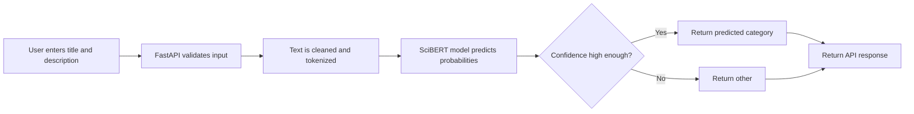

# Made With ML Project Classifier — Complete Beginner Explanation

This document explains the project from the beginning. You do not need to know machine learning, APIs, Ray, MLflow, or Docker before reading it.

## 1. What is this project?

This project is a **machine-learning web application**. Its job is to read a short description of a machine-learning project and decide which category best matches that project.

For example, a user can enter:

```text
Title: Transfer learning with transformers
Description: Using transformers for text classification tasks.
```

The application reads that text and returns a predicted category, such as natural-language processing. It also returns a confidence score. A confidence score tells us how sure the model is about its answer.

In simple words, the project is like a smart automatic labeler for machine-learning project descriptions.

## 2. Why is this useful?

Imagine a website that has hundreds or thousands of machine-learning projects. Each project needs a category so users can search for projects about NLP, computer vision, MLOps, and other topics.

Without this application, a person must read every project description and manually select a category. This takes time, costs money, and can be inconsistent. One person may label a project as “NLP,” while another may use a different category for a similar project.

This application helps by giving an automatic first prediction. A human can still review difficult cases, but the system reduces repetitive manual work.

## 3. What is machine learning in this project?

Machine learning means that the computer learns patterns from examples instead of being given a long list of hard-coded rules.

For example, a rule-based system might say:

```text
If a description contains the word “image”, label it computer vision.
```

This rule is weak because a project may use computer vision without using the word “image.” It can also use the word “image” in an unrelated way.

Instead, this project learns from labeled examples. The training dataset contains project titles, descriptions, and correct categories. The model studies many examples and learns language patterns that are connected to each category.

## 4. What data does the project use?

The `datasets/` folder contains CSV files. A CSV file is a simple spreadsheet-like text file. The important fields are:

| Field | Meaning |
|---|---|
| `title` | The short name of a machine-learning project. |
| `description` | A longer explanation of what the project does. |
| `tag` | The correct category for the project. This is the label the model learns from. |

The model uses the title and description as input. The tag is the expected answer during training.

For example:

| Title | Description | Tag |
|---|---|---|
| Image classification with CNNs | A model that recognizes objects in photographs. | computer vision |
| Sentiment analysis with BERT | A model that predicts sentiment from customer reviews. | natural language processing |

## 5. What happens before training?

Raw text is not immediately sent to the model. First, the project cleans and prepares the data. This process is called **preprocessing**.

The preprocessing work is in `madewithml/data.py`.

It does the following important steps:

1. Loads the CSV dataset.
2. Shuffles the data in a reproducible way.
3. Splits the data into training and validation parts.
4. Cleans the text by removing unwanted characters, URLs, and extra spaces.
5. Converts categories such as `computer-vision` into numeric IDs that a model can learn from.
6. Tokenizes text so SciBERT can understand it.

### What does “split the data” mean?

The dataset is divided into two parts:

- **Training data:** examples used by the model to learn.
- **Validation data:** examples used to check whether the model is learning useful patterns instead of only memorizing training examples.

The split is stratified. This means that each category is represented fairly in both training and validation data. It helps the evaluation be more reliable.

## 6. What is SciBERT?

SciBERT is a language model. A language model is a neural network that has already learned many relationships between words and sentences.

SciBERT was trained on scientific and technical text. This makes it a good starting point for machine-learning project descriptions because those descriptions contain words such as transformer, embedding, inference, vision, fine-tuning, and deployment.

The project does not train SciBERT from the beginning. Training a large language model from scratch would require a huge amount of data and expensive hardware. Instead, it uses **transfer learning**.

Transfer learning means:

1. Start with an existing pretrained model that already understands language.
2. Add a small new layer for this specific category task.
3. Train the model on project descriptions and their correct tags.

This gives good results with less data and less compute than starting from zero.

## 7. What is the model architecture?

The model code is in `madewithml/models.py`.

The model has two main parts:

| Part | Job |
|---|---|
| SciBERT encoder | Reads the text and creates a meaningful numeric representation of it. |
| Classification head | Uses that representation to calculate a score for every category. |

The classification head contains dropout and a linear layer.

- **Dropout** is a training technique that helps reduce overfitting. Overfitting means a model memorizes training examples but does not work well on new examples.
- **Linear layer** converts the language representation into scores for the known project categories.

At the end, the model changes the scores into probabilities. A probability near `1.0` means high confidence. A probability near `0.0` means low confidence.

## 8. How does training work?

Training code is in `madewithml/train.py`.

During training, the model repeatedly sees project descriptions and compares its predicted category with the correct category from the dataset.

The process works like this:

1. A batch of training examples is loaded.
2. The model predicts categories for those examples.
3. The project calculates a number called **loss**. Loss measures how wrong the model is.
4. The optimizer updates the model weights to reduce loss.
5. The same process repeats for many batches and epochs.

An **epoch** means the model has processed the full training dataset once.

The project also calculates validation loss after each epoch. Validation loss is important because it shows how well the model performs on examples it did not use for learning.

## 9. What is Ray and why is it used?

Ray is a framework that helps Python programs use multiple CPU cores, GPUs, or machines when needed.

This project uses Ray for several jobs:

| Ray component | Purpose in this project |
|---|---|
| Ray Data | Loads and processes the dataset. |
| Ray Train | Runs the training workflow. |
| Ray Tune | Tries different hyperparameters. |
| Ray Serve | Runs the model as a real-time web service. |

For a small local demo, Ray can run on one computer. For a larger production setup, the same project can be moved to a cluster with more resources.

## 10. What is hyperparameter tuning?

Hyperparameters are settings chosen before or during training. Examples include learning rate, dropout probability, batch size, and number of epochs.

These settings can strongly affect model quality. `madewithml/tune.py` uses Ray Tune to try different combinations of settings and compare their validation loss.

Think of it like trying different recipes. The ingredients are the same, but changing the amount of each ingredient can produce a better result. Hyperparameter tuning finds a better training recipe.

## 11. What is MLflow and why is it important?

MLflow is used for **experiment tracking**. Every time you train or tune the model, you may use different settings and get different results. Without tracking, it becomes difficult to remember which run produced the best model.

MLflow records information such as:

- Experiment name
- Hyperparameters
- Training and validation metrics
- Model checkpoint files
- Run ID

The **run ID** is very important. It is like a unique version number for a trained model. When the API makes a prediction, it returns the run ID so you know exactly which model produced that answer.

## 12. How is the model evaluated?

Evaluation code is in `madewithml/evaluate.py`.

The project checks more than one metric:

| Metric | Simple meaning |
|---|---|
| Precision | When the model predicts a category, how often is it correct? |
| Recall | Of all real examples in a category, how many did the model find? |
| F1 score | A balanced score that combines precision and recall. |
| Validation loss | A measure of model error on validation examples. |

The project also checks behavioral slices. For example, it can evaluate short project descriptions or technical NLP/LLM examples. This matters because one overall score can hide weak performance for a small but important type of input.

## 13. What happens when a user requests a prediction?

The real-time prediction flow is:



The API code is in `madewithml/serve.py`.

First, FastAPI checks that the title and description are not empty. It also limits their size. This protects the service from invalid or unexpectedly large requests.

Next, the service loads the trained model checkpoint and uses the same preprocessing logic that was used during training. This is very important. If training cleans text one way but the API cleans text differently, the model may behave poorly in production. This problem is called training-serving skew.

## 14. Why does the project sometimes return `other`?

The model always produces a category with the highest probability. However, the highest probability may still be low.

For example:

```text
NLP: 35%
Computer Vision: 30%
MLOps: 20%
Other: 15%
```

The model would technically choose NLP because 35% is the highest value. But 35% is not very confident. The project therefore uses a confidence threshold. If the highest probability is lower than the threshold, the API returns `other`.

This is a good product decision because it avoids presenting uncertain predictions as facts. In a real company, `other` cases could be sent to a human reviewer. Those reviewed cases could later improve the training dataset.

## 15. What is FastAPI?

FastAPI is the web framework used to create the API. An API is a way for one program to communicate with another program over the internet or a local network.

This project exposes these useful endpoints:

| Endpoint | Meaning |
|---|---|
| `GET /` | Basic check that the service responds. |
| `GET /health/ready` | Confirms that the model has fully loaded. |
| `GET /run_id/` | Shows which model version is active. |
| `POST /predict/` | Sends a title and description to receive a category prediction. |
| `POST /evaluate/` | Runs offline evaluation on a dataset. |
| `GET /app` | Opens the custom browser interface. |
| `GET /docs` | Opens interactive API documentation. |

FastAPI automatically creates the `/docs` page. This page lets you test endpoints without writing code. It is useful in a demo because it makes the API visible and easy to understand.

## 16. What is Ray Serve?

Ray Serve is the system that keeps the model ready for real-time requests.

Instead of loading the model every time a user asks for a prediction, Ray Serve loads the model into a deployment replica. A replica is a running copy of the service. When a new request arrives, the loaded replica handles it.

In the future, you can create more replicas to handle more users at the same time. The settings `MODEL_REPLICAS`, `MODEL_CPUS`, and `MODEL_GPUS` control this behavior.

## 17. What information does a prediction response contain?

A prediction response includes more than the category:

```json
{
  "request_id": "unique-request-id",
  "model_run_id": "mlflow-model-run-id",
  "latency_ms": 125.4,
  "results": [
    {
      "prediction": "natural-language-processing",
      "probabilities": {
        "natural-language-processing": 0.91,
        "computer-vision": 0.04
      }
    }
  ]
}
```

Here is what each field means:

| Field | Why it matters |
|---|---|
| `request_id` | Helps find one specific request in logs if something goes wrong. |
| `model_run_id` | Identifies the exact MLflow model version used. |
| `latency_ms` | Shows how long the prediction took in milliseconds. |
| `prediction` | The final category returned to the user. |
| `probabilities` | Shows the model’s confidence for every category. |

## 18. What is the web app?

The web app is a simple, responsive user interface located at `/app`. It was added so a user can test the classifier without using a command line or Swagger documentation.

The web app lets users:

1. Enter a project title.
2. Enter a description.
3. Use sample NLP, computer-vision, or MLOps examples.
4. Click **Classify project**.
5. View the predicted category and confidence bars.
6. See model latency and request information.

The web app sends its request to the same `/predict/` endpoint used by other programs. This means the browser page is a real client of the application, not a separate fake demo.

## 19. What is Cloudflare Tunnel in this project?

Normally, `http://127.0.0.1:8000` works only on your own computer. Cloudflare Tunnel can temporarily create a public HTTPS link to that local service.

This is useful when you want to show the project to a friend, interviewer, or client without deploying it to a cloud server.

The command is:

```bash
cloudflared tunnel --url http://127.0.0.1:8000
```

Cloudflare prints a temporary URL. You can add `/app` to that URL to open the web interface.

Important: this is a demo tool, not a permanent deployment. The link works only while the local API and Cloudflare tunnel are running.

## 20. What files are most important?

| File or folder | What it does |
|---|---|
| `datasets/` | Stores the CSV data used by training and evaluation. |
| `madewithml/data.py` | Loads, cleans, splits, and tokenizes data. |
| `madewithml/models.py` | Defines the SciBERT classifier model. |
| `madewithml/train.py` | Trains the model. |
| `madewithml/tune.py` | Searches for better training settings. |
| `madewithml/evaluate.py` | Calculates evaluation metrics. |
| `madewithml/predict.py` | Loads saved models and makes predictions. |
| `madewithml/serve.py` | Starts the API and web app. |
| `madewithml/web/index.html` | Contains the browser design and CSS. |
| `tests/` | Contains automated checks for data, code, and model behavior. |
| `deploy/` | Contains cloud and Ray deployment configuration. |
| `Dockerfile` | Defines a repeatable container environment. |
| `README.md` | Full project documentation. |
| `docs/demo-guide.md` | Script for presenting the project to others. |

## 21. How do I run the project locally?

First activate the Python environment:

```bash
cd /Users/ramsaijeevan001/Documents/Codex/2026-07-15/c/outputs/Made-With-ML-GitHub
source venv/bin/activate
export PYTHONPATH="$PWD"
export GITHUB_USERNAME="local"
```

Start the model service:

```bash
python madewithml/serve.py --run_id "f5824cd78e2344198e73c436048b88f2"
```

Then open one of these addresses in your browser:

| Address | What it shows |
|---|---|
| `http://127.0.0.1:8000/app` | Friendly web app for classifying projects. |
| `http://127.0.0.1:8000/docs` | Interactive API documentation. |
| `http://127.0.0.1:8000/health/ready` | Model readiness status. |

## 22. What is already good about this project?

This project already includes many important production-minded ideas:

- Input validation protects the API from empty or oversized text.
- Confidence thresholds handle uncertainty more safely.
- MLflow run IDs make predictions traceable.
- Readiness checks help deployment tools know when the model is loaded.
- Request IDs help with debugging.
- Tests check code, data, and model behavior.
- Docker uses a non-root user.
- Ray makes it possible to scale training and serving later.
- The web app makes the system easy to demonstrate.

## 23. What should be improved before a real production launch?

For a serious public or company deployment, add:

1. User authentication so only approved users can call the API.
2. Rate limiting to prevent abuse and expensive request floods.
3. Permanent cloud hosting instead of a temporary local tunnel.
4. Managed model artifact storage.
5. Monitoring dashboards for latency, failures, confidence, and model drift.
6. Alerts when errors or low-confidence predictions increase.
7. Human review for difficult predictions.
8. Canary deployment so a new model can be tested safely before all users receive it.
9. A rollback plan to return to a previous model version quickly.
10. Clear data privacy and logging policies.

## 24. One-minute explanation for your demo

> “This is an end-to-end machine-learning project classifier. A user enters a project title and description, and the system predicts the most suitable ML category. The data is cleaned and tokenized before being processed by SciBERT, a transformer model designed for scientific text. Ray handles training, tuning, and serving. MLflow tracks every experiment and model checkpoint. The live API validates input, returns probability scores, latency, request IDs, and the exact model version used. If the model is not confident, it returns `other` instead of giving a misleading answer. I also built a responsive web interface so users can test the model without technical knowledge.”

## 25. Final summary

This project is not only a trained model. It is a complete system that shows the journey from data to a real-time user experience.

The main idea is simple: automatically organize machine-learning project descriptions. The implementation is more advanced: it uses scientific-language transformers, distributed ML tools, experiment tracking, evaluation, APIs, health checks, deployment configuration, and a web interface.

When you explain the project, remember these three points:

1. **Business value:** it saves time and makes project information easier to organize and search.
2. **Machine-learning value:** it learns categories from examples using SciBERT and evaluates results with metrics.
3. **Engineering value:** it provides a real API, model version tracking, confidence handling, tests, and deployment foundations.
